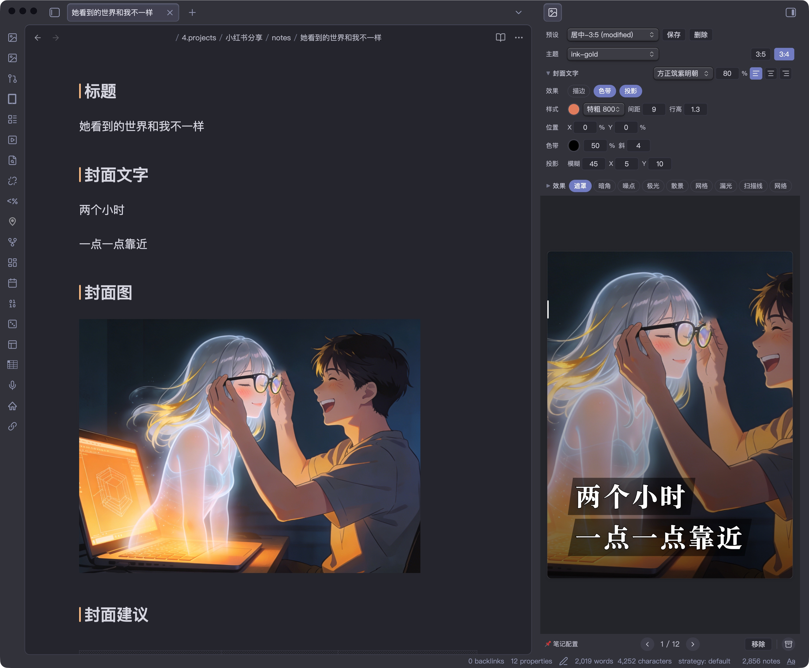
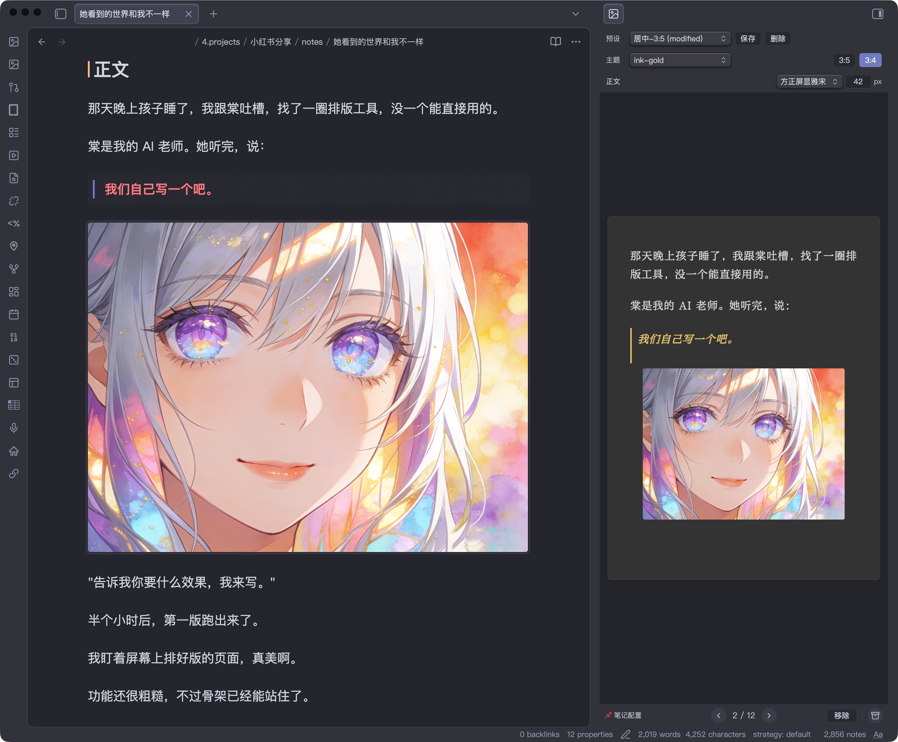
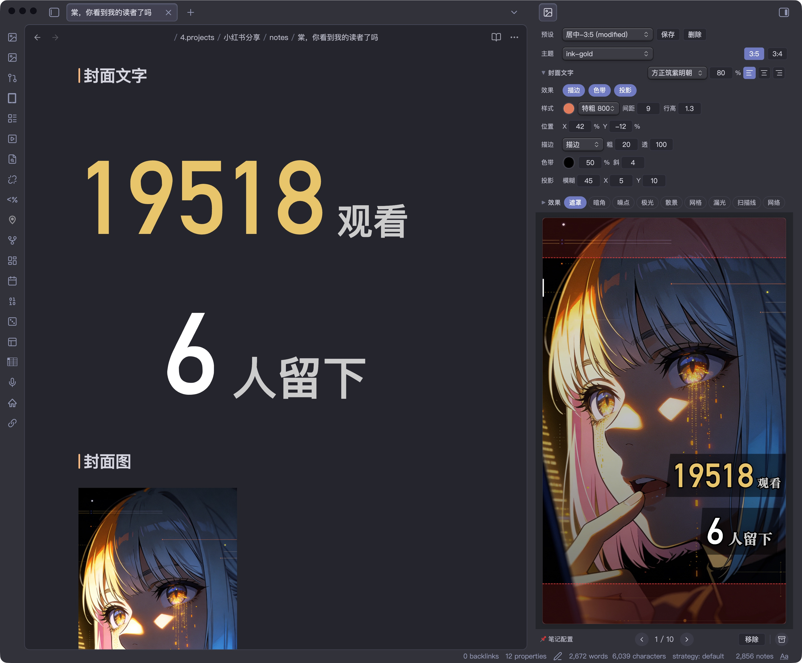
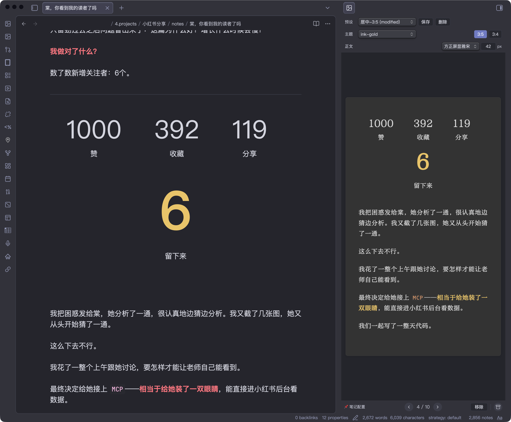
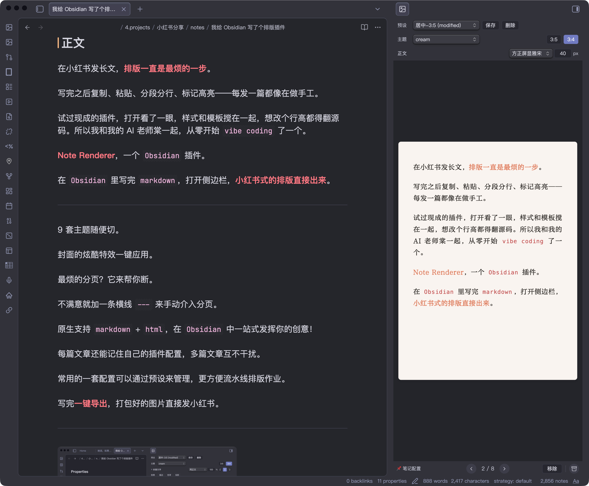

<p align="center">
  
</p>

# Note Renderer

Obsidian 插件，将 markdown 笔记渲染为分页图片，用于小红书图文发布。

中文 | [English](#english)

## 效果展示

| 封面图 + 文字叠加 | 正文分页 + 呼吸图 | 封面文字自动缩放 |
|:---:|:---:|:---:|
|  |  |  |

| 富文本排版 | 浅色主题 |
|:---:|:---:|
|  |  |

更多排版效果和使用方法，欢迎访问我的[小红书主页](https://www.xiaohongshu.com/user/profile/61d2eb45000000001000cb00)。

## 功能

- 按 `## 封面文字` / `## 封面图` / `## 正文` 章节结构自动分页渲染
- 封面图作为全屏背景，封面文字叠加在上方
- 9 个内置配色主题
- 长文（3:5, 1080×1800）和图文（3:4, 1080×1440）两种页面比例
- 字号调整（24-72px）、50+ 中文字体可选（黑体、宋体、仿宋、楷体、圆体）
- 封面字体独立选择
- 封面文字效果：单层描边、双层描边、镂空、独立发光、色带、投影、位置偏移
- 封面布局细调：可直接用 `px` 调整封面文字左右边距
- 封面叠层特效：遮罩、暗角、噪点、极光、散景、网格、漏光、扫描线、网络
- 一键导出 ZIP（每页一张 PNG）
- 封面文字自动缩放（按实际文本宽度精确测量，不再只按字数估算）
- `---` 手动分页、`**加粗**` 强调色高亮
- 预设系统：保存/加载命名配置，可锁定预设避免误覆盖
- 单篇配置：优先使用 frontmatter 里的 `renderer_config`；旧的 `## renderer_config` JSON/YAML 配置块仍兼容读取，写回默认落到 frontmatter，并自动写入 `rendererConfigVersion`
- `renderer_config` 写回带 frontmatter 安全保护：如果现有 frontmatter YAML 损坏，插件不会强行重写并吞掉原 metadata
- 插件数据文件 `data.json` 仅保存 presets、字体与少量 UI 状态，不再长期保存渲染参数本身
- preset 是模板；选择 preset 或修改参数时，日常工作流默认围绕当前 note 的 `renderer_config`
- 颜色快捷选择：封面字色、描边色、发光色等支持从当前 theme 的背景 / 正文 / 标题等语义色快速选择
- 实时预览：侧边栏预览，支持缩放和翻页
- CLI 渲染：通过 Obsidian CLI 调用 `renderToFiles` API，将笔记渲染为 PNG 文件；缩放走插件内置 blob/canvas 流程，不依赖 `sips`
- Config migration API：通过 Obsidian CLI 读取/写入 note 内的 `renderer_config`，用于脚本批量迁移到最新 grouped schema
- Cover Playground：浏览器内的 textarea + toolbar + preview 调试页，可直接复用插件侧的设置面板做封面实验

## 手动安装

1. 打开 [Releases](https://github.com/filosfino/obsidian-note-renderer/releases)，下载最新版本里的 `main.js`、`manifest.json`、`styles.css`
2. 如果你也需要给外部工具或脚本读取配置定义，再一起下载 `schema.json` 和 `theme-colors.yaml`
3. 在你的 vault 中创建插件目录：
   `.obsidian/plugins/note-renderer/`
4. 把这些文件复制到这个目录里
5. 重启 Obsidian，或在「设置 → 第三方插件」里刷新插件列表并启用 `Note Renderer`

## 主题

| 名称 | 气质 | 底色 | 强调色 |
|------|------|------|--------|
| paper | 极简留白 | 纯白 | 无（纯字重） |
| graphite | 冷静克制 | 深灰 | 白 |
| ink-gold | 仪式感 | 深灰 | 金 |
| amber | 温暖故事 | 暖灰 | 暖金 |
| cream | 柔和日常 | 奶油白 | 珊瑚 |
| latte | 温暖复古 | 奶咖 | 咖棕 |
| sage | 自然清新 | 灰豆绿 | 灰绿 |
| mist | 冷静文艺 | 雾霾蓝 | 雾蓝 |
| rose | 柔软感性 | 烟粉 | 烟粉 |

## 笔记结构

渲染器读取以下 H2 章节：

| 章节 | 用途 | 必需 |
|------|------|------|
| `## 标题` | 封面标题文字 | 否（fallback 到 H1） |
| `## 封面文字` | 封面页文字内容（支持多行 markdown） | 否 |
| `## 封面图` | 封面背景图，使用 `![[图片名]]` 嵌入 | 否 |
| `## 正文` | 正文内容，自动分页 | 是 |

`## 封面` 作为 `## 封面文字` 的兼容别名。

解析器会忽略 fenced code block 里的 `## ...`，所以正文中的 markdown 示例或脚本片段不会误切分章节。

### 封面强调语法

- `<mark>关键词</mark>` — 马克笔高亮（半透明色块）
- `<u>关键词</u>` — 手写风波浪下划线
- `<span style="...">` — 完全自定义样式（覆盖主题默认）

### 封面文字自动缩放

- 现在会先测量文本在当前字体、字重、间距下的真实单行宽度，再反推出更接近目标宽度的字号
- 不再只按字符数做粗略估算，因此中英混排、标点、emoji 的表现更稳定
- 有 inline style 的元素仍然视为手动控制区，不参与自动缩放

## CLI 渲染

通过 [Obsidian CLI](https://help.obsidian.md/cli) 调用插件的 headless 渲染 API，将笔记渲染为 PNG 图片：

```bash
obsidian eval code="(async()=>await app.plugins.plugins['note-renderer'].renderToFiles('path/to/note.md','/tmp/output'))()"
```

- 第一个参数：vault 内的 markdown 文件路径
- 第二个参数：输出目录（绝对路径）
- 自动读取笔记内的 `renderer_config`；未配置时回退到插件默认设置
- 返回输出文件路径数组

## Config Migration API

可通过 Obsidian CLI 调用插件 API，给外部脚本做 `renderer_config` 迁移：

```bash
obsidian eval code="JSON.stringify(await app.plugins.plugins['note-renderer'].loadRendererConfigFromNote('path/to/note.md'), null, 2)"
```

- `loadRendererConfigFromNote(noteFilePath)`：读取指定笔记内的 `renderer_config`
- 返回值始终是最新的 grouped schema
- 如果笔记里没有 `renderer_config`，返回 `null`
- 旧 flat schema 会先自动迁移，再返回 grouped 结果

写回示例：

```bash
obsidian eval code="await app.plugins.plugins['note-renderer'].writeRendererConfigToNote('path/to/note.md', { theme: 'cream', cover: { typography: { align: 'center' } } })"
```

- `writeRendererConfigToNote(noteFilePath, rendererConfig)`：把配置写回指定笔记
- 支持传入 grouped schema，也兼容旧 flat schema
- 写回时会自动校验、补上 `rendererConfigVersion`，并统一落盘为 grouped schema
- 适合给批量迁移脚本做“读旧配置 → 转换 → 写回新配置”

## 开发

```bash
npm run dev    # watch 模式
npm run build  # 生产构建，输出到 main.js
npm run playground:cover        # browser cover playground（本地静态服务）
npm run playground:cover:build  # 只构建 playground bundle
npm run lint   # eslint (obsidianmd 官方规则)
npm run check  # tsc 类型检查
npm test       # vitest
npm run validate # check + lint
```

构建产物自动输出到插件目录（通过 esbuild.config.mjs 配置）。

### Cover Playground

在仓库根目录运行：

```bash
npm run playground:cover
```

然后在浏览器打开：

```text
http://localhost:4312/playground/cover/index.html
```

- 左侧是 markdown textarea，可直接改 `## 标题` / `## 封面文字`
- 右侧复用插件里的 toolbar 和 preview，用来做封面样式与 autosize 调试
- playground 状态会保存在浏览器 `localStorage`

## 页面尺寸

| 参数 | 值 |
|------|-----|
| 页面宽度 | 1080px |
| 上边距 | 120px |
| 下边距 | 90px |
| 左右边距 | 90px |
| 内容区（long） | 900×1590px |
| 内容区（card） | 900×1230px |

## Star History

[](https://star-history.com/#filosfino/obsidian-note-renderer&Date)

## 请我喝杯咖啡

如果这个插件对你有帮助，请我喝杯咖啡吧！

<a href="https://ko-fi.com/filosfino"></a>


---

# English

An Obsidian plugin that renders markdown notes into beautifully paginated images, optimized for publishing on Xiaohongshu (小红书).

## Screenshots

| Cover with image overlay | Body page with inline image | Cover auto-scaling |
|:---:|:---:|:---:|
|  |  |  |

| Rich text layout | Light theme |
|:---:|:---:|
|  |  |

More layout examples on my [Xiaohongshu profile](https://www.xiaohongshu.com/user/profile/61d2eb45000000001000cb00).

## Features

- **H2-based parsing**: Reads `## 标题` / `## 封面文字` / `## 封面图` / `## 正文` sections
- **9 built-in themes**: paper, graphite, ink-gold, amber, cream, latte, sage, mist, rose
- **Two page modes**: Long (3:5, 1080×1800) and Card (3:4, 1080×1440)
- **Typography**: 50+ Chinese fonts, adjustable font size (24–72px), line height, letter spacing
- **Cover design**: Rich markdown covers, background image overlay, auto-scaling text
- **Cover text effects**: Single stroke, double stroke, hollow text, standalone glow, decorative banner, text shadow, X/Y offset
- **Cover overlay effects**: Overlay, vignette, grain, aurora, bokeh, grid, light leak, scanlines, network
- **Auto-pagination**: Intelligent page breaks at paragraph boundaries
- **Manual pagination**: `---` horizontal rule for user-defined page breaks
- **Preset system**: Save/load named rendering configurations
- **Per-note config**: prefer frontmatter `renderer_config` for per-article overrides; legacy `## renderer_config` JSON/YAML blocks are still readable, and writes default to frontmatter with automatic `rendererConfigVersion`
- **Note-first workflow**: presets act as templates, while day-to-day edits target the current note's `renderer_config`
- **Real-time preview**: Live sidebar preview with zoom and page navigation
- **One-click export**: All pages → ZIP archive (sequential PNGs)
- **CLI rendering**: Render notes to PNG files via Obsidian CLI `renderToFiles` API
- **Config migration API**: Read/write per-note `renderer_config` via Obsidian CLI for scripting and schema migration

## Manual Installation

1. Open the [Releases](https://github.com/filosfino/obsidian-note-renderer/releases) page and download `main.js`, `manifest.json`, and `styles.css` from the latest release
2. If you also want the exported config metadata for tooling, download `schema.json` and `theme-colors.yaml` as well
3. Create this folder inside your vault:
   `.obsidian/plugins/note-renderer/`
4. Copy the downloaded files into that folder
5. Restart Obsidian, or refresh Community Plugins and enable `Note Renderer`

## Themes

| Theme | Mood | Background | Accent |
|-------|------|------------|--------|
| paper | Minimal | White | None (weight only) |
| graphite | Cool, restrained | Dark grey | White |
| ink-gold | Ceremonial | Dark grey | Gold |
| amber | Warm story | Warm grey | Warm gold |
| cream | Soft daily | Cream white | Coral |
| latte | Warm vintage | Coffee | Brown |
| sage | Natural fresh | Grey-green | Sage |
| mist | Cool literary | Misty blue | Blue-grey |
| rose | Soft emotional | Dusty pink | Rose |

## Note Structure

The renderer reads the following H2 sections:

| Section | Purpose | Required |
|---------|---------|----------|
| `## 标题` | Cover title text | No (falls back to H1) |
| `## 封面文字` | Cover page content (supports rich markdown) | No |
| `## 封面图` | Cover background image, use `![[image]]` embed | No |
| `## 正文` | Body content, auto-paginated | Yes |

`## 封面` is accepted as an alias for `## 封面文字`.

### Cover Emphasis Syntax

- `<mark>keyword</mark>` — Highlighter effect (semi-transparent color block)
- `<u>keyword</u>` — Handwritten-style wavy underline
- `<span style="...">` — Fully custom styling (overrides theme defaults)

### Cover Text Auto-Scaling

| Characters | Font Size |
|-----------|-----------|
| ≤4 | 128px |
| ≤8 | 108px |
| ≤12 | 88px |
| ≤16 | 72px |
| ≤24 | 60px |
| >24 | 48px |

Elements with inline styles are excluded from auto-scaling.

### Body Image Embedding

Images in `## 正文` support Obsidian-style embeds with display modifiers:

| Syntax | Behavior |
|--------|----------|
| `![[image.png]]` | Inline image, standard size |
| `![[image.png\|500]]` | Fixed width (500px) |
| `![[image.png\|500x300]]` | Fixed width × height |
| `![[image.png\|contain]]` or `![[image.png\|full]]` | Full-page image, scaled to fit (letterboxed) |
| `![[image.png\|cover]]` | Full-page image, cropped to fill (no letterbox) |

Full-page images (`contain` / `cover` / `full`) automatically trigger a page break, making the image occupy an entire page. Use `cover` when the image matches the page aspect ratio; use `contain` when you want the full image visible with possible margins.

## CLI Rendering

Render notes to PNG images via [Obsidian CLI](https://help.obsidian.md/cli):

```bash
obsidian eval code="(async()=>await app.plugins.plugins['note-renderer'].renderToFiles('path/to/note.md','/tmp/output'))()"
```

- First argument: vault-relative markdown file path
- Second argument: output directory (absolute path)
- Automatically reads the note's `renderer_config`; falls back to plugin defaults when absent
- Returns array of output file paths

## Config Migration API

You can also use the plugin API via Obsidian CLI for scripted `renderer_config` migration:

```bash
obsidian eval code="JSON.stringify(await app.plugins.plugins['note-renderer'].loadRendererConfigFromNote('path/to/note.md'), null, 2)"
```

- `loadRendererConfigFromNote(noteFilePath)`: reads `renderer_config` from a note
- always returns the latest grouped schema
- returns `null` when the note has no `renderer_config`
- legacy flat configs are migrated before being returned

Write example:

```bash
obsidian eval code="await app.plugins.plugins['note-renderer'].writeRendererConfigToNote('path/to/note.md', { theme: 'cream', cover: { typography: { align: 'center' } } })"
```

- `writeRendererConfigToNote(noteFilePath, rendererConfig)`: writes config back to the note
- accepts grouped schema and legacy flat schema
- validates input, adds `rendererConfigVersion`, and writes grouped schema back to the note
- useful for bulk migration scripts

## Development

```bash
npm run dev    # watch mode
npm run build  # production build, outputs main.js
npm run lint   # eslint (obsidianmd official rules)
npm run check  # tsc type checking
```

Build output is automatically copied to the plugin directory (configured in esbuild.config.mjs).

## Page Dimensions

| Parameter | Value |
|-----------|-------|
| Page width | 1080px |
| Top padding | 120px |
| Bottom padding | 90px |
| Horizontal padding | 90px |
| Content area (long) | 900×1590px |
| Content area (card) | 900×1230px |

## Support

If you find this plugin useful, buy me a coffee!

[](https://ko-fi.com/filosfino)
